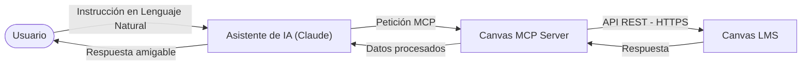

# 🎓 Canvas LMS MCP Server

[](https://www.npmjs.com/package/@charlie.act7/canvas-mcp-server)
[](https://opensource.org/licenses/MIT)

¡Lleva tu aula virtual de Canvas al siguiente nivel con Inteligencia Artificial! 🚀

Este proyecto es un servidor de **Model Context Protocol (MCP)** para **Canvas LMS**. Funciona como un puente que permite a asistentes de Inteligencia Artificial (como Claude Desktop, Claude Code, Cursor, etc.) consultar y administrar tus cursos de Canvas mediante instrucciones en lenguaje natural.

---

## Tabla de Contenidos
- [¿Cómo funciona?](#cómo-funciona)
- [Ejemplos de Uso](#ejemplos-de-uso)
- [Guía de Instalación](#guía-de-instalación)
  - [Paso 1: Obtener credenciales de Canvas](#paso-1-obtener-credenciales-de-canvas)
  - [Paso 2: Configurar tu Cliente de IA](#paso-2-configurar-tu-cliente-de-ia)
- [Configuración por Consola (CLI)](#configuración-por-consola-cli)
- [Herramientas y Recursos Soportados](#herramientas-y-recursos-soportados)
- [Desarrollo Local](#desarrollo-local)
- [Licencia](#licencia)

---

## ¿Cómo funciona?

Cuando utilizas este servidor, la comunicación fluye de la siguiente manera:



1. **Tú le pides algo al asistente** (por ejemplo: *"Crea una tarea para el próximo viernes"*).
2. **El asistente detecta la intención** y se comunica con el **Canvas MCP Server** enviándole los parámetros necesarios.
3. **El servidor realiza la llamada segura** a la API de Canvas.
4. **Canvas procesa la acción** y devuelve el resultado.
5. **El asistente te confirma el éxito de la operación** en lenguaje natural.

---

## Ejemplos de Uso

Aquí tienes algunos ejemplos de consultas y acciones reales que puedes pedirle a tu asistente:

> [!TIP]
> **Ahorro de Tokens y Eficiencia:** Siempre que sea posible, especifica el ID o la URL directa de Canvas (por ejemplo, `https://[tu_institucion].instructure.com/courses/[codigo_curso]/assignments/[codigo_actividad]`) en tus instrucciones. Esto evita que la IA tenga que buscar y escanear todos tus recursos, lo que resulta en respuestas mucho más rápidas y un ahorro significativo de tokens.

### 📖 Para Consultar Información y Auditar Cursos
* 💬 *"¿Qué cursos tengo activos este semestre? Verifica si existen múltiples paralelos o secciones."*
* 💬 *"Muéstrame las entregas pendientes de calificar para la actividad 'PE-2.1: Algoritmos de Ordenamiento' en Programación 101."*
* 💬 *"¿Cuáles son los estudiantes registrados en el Grupo B de la clase de Física?"*
* 💬 *"Verifica si la tarea 'PE-2.1' tiene una rúbrica activa asociada. Si es así, obtén sus criterios."*

### ✍️ Para Administrar y Crear Contenido Académico
* 💬 *"Crea un nuevo módulo llamado 'Semana 4: Estructuras de Datos' en mi curso."*
* 💬 *"Agrega un subencabezado 'RECURSOS DE APRENDIZAJE' dentro del módulo 'Semana 4' y vincula la página de materiales de estudio."*
* 💬 *"Crea una tarea llamada 'PE-2.1: Algoritmos de Ordenamiento' en mi curso. Añade una tabla de instrucciones con las columnas: Actividad, Instrucciones específicas y Entregable."*

### 💯 Para Calificar y Gestionar Inasistencias
* 💬 *"Para la tarea 'PE-2.1', identifica a los estudiantes que no entregaron a tiempo. Asígnales una nota de 0 y deja el comentario: 'No asistió a clases. Si desea recuperar la actividad, debe enviar un correo al docente explicando el motivo.'"*
* 💬 *"Califica la entrega de María en 'PE-2.1' con un 90 basado en la rúbrica y agrégale la retroalimentación: 'Buen trabajo, el análisis sobre ordenamiento es correcto. Se observa un buen desarrollo de la lógica. Sin embargo, faltó detallar el análisis de complejidad temporal.'"*

---

## Guía de Instalación

Para conectar tu asistente de IA a Canvas, necesitas configurar **dos cosas**: tus credenciales de Canvas y el cliente de IA (como Claude).

### Paso 1: Obtener credenciales de Canvas
Para que el servidor pueda actuar en tu nombre, necesita permiso:
1. Inicia sesión en tu cuenta de **Canvas LMS**.
2. Dirígete a **Cuenta (Account)** ➡️ **Configuración (Settings)** en el menú lateral.
3. Baja hasta la sección **Integraciones Aprobadas (Approved Integrations)** y haz clic en el botón **+ Nuevo token de acceso (+ New Access Token)**.
4. Escribe un propósito (ej. "Asistente Claude") y haz clic en **Generar token**.
5. **Copia el token generado inmediatamente** y guárdalo en un lugar seguro (no podrás volver a verlo después de cerrar la pantalla).

> [!IMPORTANT]
> También necesitarás el dominio de tu Canvas. Es la dirección web de tu escuela/universidad, por ejemplo: `miuniversidad.instructure.com`.

---

### Paso 2: Configurar tu Cliente de IA

#### Opción A: Claude Desktop (Aplicación de Escritorio)
1. Abre tu archivo de configuración de Claude Desktop. En Windows se encuentra en:
   `%APPDATA%\Claude\claude_desktop_config.json`
   *(En macOS: `~/Library/Application Support/Claude/claude_desktop_config.json`)*
2. Agrega la configuración del servidor Canvas bajo `mcpServers`:

```json
{
  "mcpServers": {
    "canvas": {
      "command": "npx",
      "args": ["-y", "@charlie.act7/canvas-mcp-server"],
      "env": {
        "CANVAS_API_TOKEN": "TU_TOKEN_DE_ACCESO_AQUÍ",
        "CANVAS_API_DOMAIN": "miuniversidad.instructure.com"
      }
    }
  }
}
```
3. Guarda el archivo y reinicia Claude Desktop. Verás un icono de enchufe indicando que el servidor está conectado.

#### Opción B: Claude Code (Terminal)
Si utilizas la herramienta de línea de comandos Claude Code, simplemente instala el plugin ejecutando:
```bash
/plugin install canvas-lms@claude-community
```
Luego, configura tus credenciales de forma interactiva:
```bash
/canvas-lms:config
```

---

## Configuración por Consola (CLI)
Si prefieres configurar las credenciales de manera local e interactiva en tu terminal para desarrollo, puedes ejecutar:
```bash
npx @charlie.act7/canvas-mcp-server config
```
Esto te pedirá el dominio y tu API token paso a paso, guardándolos de forma segura en un archivo de configuración local.

---

## Herramientas y Recursos Soportados

<details>
<summary><b>Ver Lista Detallada de Herramientas y Recursos Soportados (Técnico)</b></summary>

### Lista de Herramientas

El servidor expone internamente las siguientes herramientas organizadas por categorías:

| Categoría | Herramientas Incluidas |
|---|---|
| **Cursos (Courses)** | Listar cursos, detalles del curso, configuración básica |
| **Módulos (Modules)** | Listar y gestionar módulos del curso |
| **Páginas (Pages)** | Listar páginas de contenido, leer el HTML de una página |
| **Archivos (Files)** | Listar archivos cargados en el curso |
| **Anuncios (Announcements)** | Listar y crear anuncios para el curso |
| **Tareas (Assignments)** | Listar, crear, actualizar tareas y modificar fechas de entrega masivamente |
| **Entregas (Submissions)** | Ver entregas y archivos adjuntos de alumnos |
| **Calificaciones (Grading)** | Calificar entregas de tareas, auditar notas del curso |
| **Exámenes (Quizzes)** | Listar quizzes, gestionar preguntas y modificar fechas límite |
| **Estudiantes (Students)** | Roster de alumnos, progreso de aprendizaje y detalles |
| **Grupos (Groups)** | Listar y gestionar grupos de estudiantes |
| **Calendario (Calendar)** | Listar y crear eventos o recordatorios en la agenda |
| **Rúbricas (Rubrics)** | Crear y gestionar rúbricas de evaluación |
| **Comunicación (Communication)** | Enviar mensajes directos, gestionar foros y discusiones |

### Recursos MCP Soportados
Para clientes compatibles con recursos directos:
* `canvas://courses/{id}/readme` — Resumen general formateado de un curso.
* `canvas://courses/{id}/pages/{slug}` — Contenido HTML directo de páginas de Canvas.
</details>

---

## Desarrollo Local

Si deseas clonar este repositorio y hacer modificaciones:

1. **Instalar Dependencias:**
   ```bash
   npm install
   ```
2. **Compilar el Proyecto (TypeScript a JavaScript):**
   ```bash
   npm run build
   ```
3. **Ejecutar Servidor en Modo Stdio (MCP):**
   ```bash
   npm start
   ```
4. **Ejecutar Servidor HTTP con Documentación Swagger:**
   Si deseas utilizarlo como una acción de GPTs de OpenAI, levanta el servidor web con:
   ```bash
   npm run start:http
   ```
   Si deseas ver la interfaz interactiva de Swagger, visita `http://localhost:3000`.

---

## Licencia
Este proyecto está bajo la licencia MIT. Creado por [Charlie Cárdenas Toledo](https://github.com/charlie-act7).
