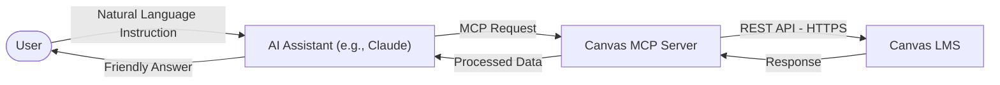

# 🎓 Canvas LMS MCP Server

[](https://github.com/CharlieCardenasToledo/mcp-canvas-server/actions/workflows/ci.yml)
[](https://www.npmjs.com/package/@charlie.act7/canvas-mcp-server)
[](https://www.npmjs.com/package/@charlie.act7/canvas-mcp-server)
[](https://opensource.org/licenses/MIT)

Bring AI to your Canvas Virtual Classroom! 🚀

This project is a **Model Context Protocol (MCP)** server for **Canvas LMS**. It acts as a bridge that allows AI assistants (like Claude Desktop, Claude Code, Cursor, etc.) to query and manage your Canvas courses using natural language.

---

## Table of Contents
- [How It Works](#how-it-works)
- [Use Cases & Examples](#use-cases--examples)
- [Setup Guide](#setup-guide)
  - [Step 1: Obtain Canvas Credentials](#step-1-obtain-canvas-credentials)
  - [Step 2: Connect to your AI Client](#step-2-connect-to-your-ai-client)
- [CLI Configuration](#cli-configuration)
- [Supported Tools & Resources](#supported-tools--resources)
- [Local Development](#local-development)
- [License](#license)

---

## How It Works

When you interact with the server, communication flows as follows:



1. **You ask the AI** (e.g., *"Create an assignment due next Friday"*).
2. **The AI detects your intent** and communicates with the **Canvas MCP Server**, sending the required parameters.
3. **The server makes a secure call** to the official Canvas API.
4. **Canvas processes the action** and returns the response.
5. **The AI confirms the success of the action** back to you in plain, natural language.

---

## Use Cases & Examples

Here are some realistic, everyday prompts you can use with your AI assistant:

> [!TIP]
> **Token Saving & Efficiency:** Whenever possible, specify the Canvas ID or the direct Canvas URL (e.g., `https://[your_institution].instructure.com/courses/[course_id]/assignments/[assignment_id]`) in your prompts. This prevents the AI from scanning all your courses/resources, leading to faster responses and substantial token savings.

### 📖 Course Auditing & Querying
* 💬 *"What active courses do I have this semester? Check if there are multiple active sections/parallels."*
* 💬 *"Show me all ungraded submissions for 'Essay 1: Introduction to Sociology' in Sociology 101."*
* 💬 *"Who is in Student Group A for the Chemistry class?"*
* 💬 *"Does the assignment 'Project Proposal' have an active rubric associated? If so, retrieve its criteria."*
* 💬 *"Search for everything related to 'photosynthesis' across my Biology course — assignments, pages, and discussions."*

### ✍️ Creating & Organizing Course Content
* 💬 *"Create a new module named 'Week 1: Foundations' in my course."*
* 💬 *"Add a SubHeader 'REQUIRED READINGS' inside the 'Week 1' module, and link the syllabus page to it."*
* 💬 *"In my Business course, create an assignment called 'Case Study 1: Market Analysis'. Add an instructions table with columns for Criteria, Requirements, and Points."*
* 💬 *"Create a threaded discussion topic in my course titled 'Weekly Reflection' and pin it to the top."*

### 💯 Grading & Absence Management
* 💬 *"For assignment 'Case Study 1', find all students who haven't submitted their work. Assign them a grade of 0 and add the comment: 'Activity not submitted. Please contact the instructor if you have a valid excuse.'"*
* 💬 *"Grade John's submission for 'Essay 1' with a 90 based on the rubric, and add a comment: 'Great job! The analysis is well-structured, though you could expand more on the conclusion. Keep it up!'"*

### 📊 Student Engagement & Analytics
* 💬 *"Show me the activity analytics for my Calculus course — how active have students been this week?"*
* 💬 *"Which students haven't been active in course 12345 in the last few days? I want to reach out to them."*
* 💬 *"Get the analytics for student [ID] in my Biology course — how many page views and participations do they have?"*

### 💬 Messaging & Communication
* 💬 *"Send a private message to student [ID] reminding them their 'Project Proposal' is due tomorrow."*
* 💬 *"How many unread messages do I have in my Canvas inbox?"*
* 💬 *"Show me my last 10 inbox conversations."*

### 👥 Enrollment & Student Management
* 💬 *"Who is enrolled in my course? Show me students and TAs separately."*
* 💬 *"Search for a student named 'Maria Gonzalez' in account 1."*
* 💬 *"Enroll user [ID] as a TA in my Physics course."*

### 🔄 Peer Reviews
* 💬 *"List all peer review assignments for 'Research Paper' in course 12345."*
* 💬 *"Manually assign student [ID] to review [other student ID]'s submission for 'Essay 2'."*

---

## Setup Guide

To connect your AI assistant to Canvas, you need to configure **two things**: your Canvas credentials and your AI client (like Claude).

### Step 1: Obtain Canvas Credentials
To let the server act on your behalf, it needs permission:
1. Log in to your **Canvas LMS** account.
2. Go to **Account** ➡️ **Settings** in the sidebar menu.
3. Scroll down to the **Approved Integrations** section and click **+ New Access Token**.
4. Enter a purpose (e.g., "Claude Assistant") and click **Generate Token**.
5. **Copy the generated token immediately** and store it somewhere safe (you won't be able to see it again after closing the page).

> [!IMPORTANT]
> You will also need your Canvas Domain. This is the web address of your school/university, for example: `myschool.instructure.com`.

---

### Step 2: Connect to your AI Client

#### Option A: Claude Desktop (Desktop Application)
1. Open your Claude Desktop configuration file. On Windows, it is located at:
   `%APPDATA%\Claude\claude_desktop_config.json`
   *(On macOS: `~/Library/Application Support/Claude/claude_desktop_config.json`)*
2. Add the Canvas server configuration under `mcpServers`:

```json
{
  "mcpServers": {
    "canvas": {
      "command": "npx",
      "args": ["-y", "@charlie.act7/canvas-mcp-server"],
      "env": {
        "CANVAS_API_TOKEN": "YOUR_ACCESS_TOKEN_HERE",
        "CANVAS_API_DOMAIN": "myschool.instructure.com"
      }
    }
  }
}
```
3. Save the file and restart Claude Desktop. You will see a socket/plug icon indicating the server is successfully connected.

#### Option B: Claude Code (Terminal CLI)
If you are using the Claude Code terminal tool, install the plugin by running:
```bash
/plugin install canvas-lms@claude-community
```
Then, configure your credentials interactively:
```bash
/canvas-lms:config
```

---

## CLI Configuration
If you prefer to configure your credentials locally for development, run:
```bash
npx @charlie.act7/canvas-mcp-server config
```
This will guide you step-by-step to input your domain and API token, storing them securely in a local configuration file.

---

## Supported Tools & Resources

<details>
<summary><b>View all 111 tools organized by category</b></summary>

### Tool Inventory

| Category | Tools | Description |
|---|---|---|
| **Courses** | `list_courses` · `create_course` · `update_course` · `get_syllabus` | Manage and configure courses |
| **Modules** | `list_modules` · `create_module` · `update_module` · `delete_module` · `create_module_item` · `update_module_item` · `delete_module_item` | Full CRUD for modules and their items |
| **Pages** | `list_pages` · `get_page_content` · `create_page` · `update_page` · `delete_page` | Manage wiki pages |
| **Files & Folders** | `list_files` · `upload_file` · `update_file` · `delete_file` · `list_folders` · `create_folder` · `update_folder` · `delete_folder` | File management with folder support |
| **Assignments** | `get_assignments` · `get_assignment` · `create_assignment` · `update_assignment` · `delete_assignment` · `update_assignment_dates` · `bulk_update_due_dates` · `list_assignment_groups` | Full assignment lifecycle |
| **Submissions** | `get_submissions` · `get_submission` · `get_submission_comments` · `delete_submission_comment` · `submit_assignment` | View and manage student submissions |
| **Grading** | `grade_submission` · `grade_multiple_submissions` · `audit_course` | Grade individually or in bulk |
| **Rubrics** | `list_rubrics` · `get_rubric` · `create_rubric` · `update_rubric` · `create_rubric_association` | Build and attach grading rubrics |
| **Quizzes (Classic)** | `list_quizzes` · `get_quiz` · `create_quiz` · `update_quiz` · `update_quiz_dates` · `list_quiz_questions` · `get_quiz_question` · `create_quiz_question` · `update_quiz_question` · `delete_quiz_question` · `create_quiz_group` | Classic Canvas quiz engine |
| **New Quizzes (LTI)** | `create_new_quiz` · `update_new_quiz` · `delete_new_quiz` · `list_new_quiz_items` · `get_new_quiz_item` · `create_new_quiz_item` · `update_new_quiz_item` · `delete_new_quiz_item` | Modern LTI quiz engine (`/api/quiz/v1`) |
| **Students** | `list_students` · `list_students_with_grades` · `get_student_grades` · `get_student_assignments` · `list_assignment_due_dates` | Roster and progress tracking |
| **Enrollments** | `list_course_enrollments` · `enroll_user` · `remove_enrollment` · `get_user` · `get_profile` · `search_users` | Manage who is in your course |
| **Groups** | `list_group_categories` · `create_group_category` · `list_groups_in_category` · `create_group` · `assign_unassigned_members` · `add_group_member` | Student group management |
| **Discussions** | `list_discussions` · `get_discussion_entries` · `create_discussion` · `delete_discussion` · `post_discussion_reply` | Discussion boards |
| **Announcements** | `list_announcements` · `post_announcement` · `update_announcement` | Course announcements |
| **Conversations** | `list_conversations` · `get_conversation` · `get_conversation_unread_count` · `send_conversation` · `reply_to_conversation` | Private inbox messaging |
| **Calendar** | `list_appointment_groups` · `get_appointment_group` · `create_appointment_group` · `update_appointment_group` · `delete_appointment_group` · `list_appointment_group_users` · `list_appointment_group_groups` · `get_next_appointment` | Scheduling and appointments |
| **Analytics** | `get_course_analytics` · `get_student_analytics` · `get_course_activity_stream` · `search_course_content` | Engagement data and content search |
| **Peer Reviews** | `list_peer_reviews` · `get_submission_peer_reviews` · `create_peer_review` · `delete_peer_review` | Configure and manage peer assessments |
| **Health & Config** | `health_check` · `set_canvas_config` | Verify connection and update credentials at runtime |

### Supported MCP Resources
For clients supporting direct resources:
* `canvas://courses/{id}/readme` — Formatted course summary.
* `canvas://courses/{id}/pages/{slug}` — Direct HTML content of Canvas pages.
</details>

---

## Local Development

To clone this repository and modify the code:

1. **Install Dependencies:**
   ```bash
   npm install
   ```
2. **Build the Project (TypeScript to JavaScript):**
   ```bash
   npm run build
   ```
3. **Start Server in Stdio Mode (MCP):**
   ```bash
   npm start
   ```
4. **Start HTTP Server with Swagger Documentation:**
   If you want to use this as an OpenAI GPT Custom Action, spin up the web server with:
   ```bash
   npm run start:http
   ```
   Then visit `http://localhost:3000` to view the interactive Swagger interface.

---

## License
This project is licensed under the MIT License. Created by [Charlie Cárdenas Toledo](https://github.com/charlie-act7).
