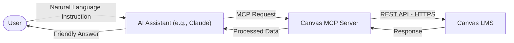

# Canvas LMS MCP Server

[](https://www.npmjs.com/package/@charlie.act7/canvas-mcp-server)
[](https://www.npmjs.com/package/@charlie.act7/canvas-mcp-server)
[](https://www.typescriptlang.org/)
[](https://modelcontextprotocol.io/)
[](./LICENSE)

Model Context Protocol (MCP) server for **Canvas LMS**. It acts as a bridge that allows AI assistants (Claude Code, Claude Desktop, Cursor, Windsurf, Cline, Roo Code, GitHub Copilot, Continue, Zed, Codex CLI, n8n, OpenAI Custom GPTs, and generic MCP clients) to query, grade, audit, and manage Canvas courses, assignments, rubrics, submissions, quizzes, conversations, and analytics using natural language. Two transports are supported: `stdio` (default) and Streamable-HTTP with interactive Swagger API documentation.

> **Versión en Español:** [README.es.md](README.es.md) | **LLM Integration Guide:** [llms-install.md](llms-install.md)

---

- [Requirements & Platform Support](#requirements--platform-support)
- [How It Works](#how-it-works)
- [Install](#install)
- [Connect to Claude Code](#connect-to-claude-code)
- [Connect to Other Clients](#connect-to-other-clients)
    - [Claude Desktop](#claude-desktop)
    - [Cursor](#cursor)
    - [Windsurf (Codeium)](#windsurf-codeium)
    - [Cline & Roo Code](#cline--roo-code)
    - [GitHub Copilot](#github-copilot)
    - [Continue.dev](#continuedev)
    - [Zed Editor](#zed-editor)
    - [Codex CLI](#codex-cli)
    - [Generic MCP Client (stdio)](#generic-mcp-client-stdio)
    - [HTTP Server & OpenAI Custom GPTs](#http-server--openai-custom-gpts)
- [Authentication & Credentials](#authentication--credentials)
- [Transports](#transports)
- [Use Cases & Prompts](#use-cases--prompts)
- [Tools](#tools)
- [Resources](#resources)
- [Configuration Reference](#configuration-reference)
- [Development](#development)
- [Documentation](#documentation)
- [License](#license)

---

## Requirements & Platform Support

- **Node.js** ≥ 18.0.0 (Node.js ≥ 20.x recommended).
- **Canvas LMS Access**: An active account on your institution's Canvas LMS (e.g. `myschool.instructure.com`).
- **Canvas API Access Token**: Generated via your Canvas Account Settings page.
- **Linux / macOS / Windows / WSL2**.

---

## How It Works

When you interact with the server, communication flows as follows:


```mermaid
graph LR
    User([User]) -->|Natural Language Instruction| AI["AI Assistant (e.g., Claude)"]
    AI -->|MCP Request| MCP["Canvas MCP Server"]
    MCP -->|REST API - HTTPS| Canvas["Canvas LMS"]
    Canvas -->|Response| MCP
    MCP -->|Processed Data| AI
    AI -->|Friendly Answer| User
```

1. **You ask the AI** (e.g., _"Create an assignment due next Friday"_).
2. **The AI detects your intent** and communicates with the **Canvas MCP Server**, sending the required parameters.
3. **The server makes a secure call** to the official Canvas LMS API over HTTPS.
4. **Canvas LMS processes the action** and returns the response payload.
5. **The AI confirms the success of the action** back to you in plain, natural language.

---

## Install

### Published package

```bash
npx @charlie.act7/canvas-mcp-server@latest
```

This is the recommended path for end users. `npx` keeps the binary cached and self-updates on `@latest`.

### Interactive CLI Setup

Configure your Canvas credentials interactively before running:

```bash
npx @charlie.act7/canvas-mcp-server config
```

### From source

```bash
git clone https://github.com/CharlieCardenasToledo/mcp-canvas-server.git
cd mcp-canvas-server
npm install
npm run build
node dist/index.js
```

---

## Connect to Claude Code

CLI form:

```bash
claude mcp add canvas \
  --env CANVAS_API_TOKEN=YOUR_ACCESS_TOKEN_HERE \
  --env CANVAS_API_DOMAIN=myschool.instructure.com \
  -- npx -y @charlie.act7/canvas-mcp-server@latest
```

Or from a local build:

```bash
claude mcp add canvas \
  --env CANVAS_API_TOKEN=YOUR_ACCESS_TOKEN_HERE \
  --env CANVAS_API_DOMAIN=myschool.instructure.com \
  -- node /absolute/path/to/mcp-canvas-server/dist/index.js
```

Manual form — drop into `~/.claude.json`:

```json
{
    "mcpServers": {
        "canvas": {
            "command": "npx",
            "args": ["-y", "@charlie.act7/canvas-mcp-server@latest"],
            "env": {
                "CANVAS_API_TOKEN": "YOUR_ACCESS_TOKEN_HERE",
                "CANVAS_API_DOMAIN": "myschool.instructure.com"
            }
        }
    }
}
```

---

## Connect to Other Clients

For step-by-step setup guides for all AI clients (Windsurf, Cline, Roo Code, Copilot, Continue, Zed, LibreChat, Custom GPTs), see [`llms-install.md`](llms-install.md).

### Claude Desktop

Edit your Claude Desktop configuration file:

- **Windows**: `%APPDATA%\Claude\claude_desktop_config.json`
- **macOS**: `~/Library/Application Support/Claude/claude_desktop_config.json`

```json
{
    "mcpServers": {
        "canvas": {
            "command": "npx",
            "args": ["-y", "@charlie.act7/canvas-mcp-server@latest"],
            "env": {
                "CANVAS_API_TOKEN": "YOUR_ACCESS_TOKEN_HERE",
                "CANVAS_API_DOMAIN": "myschool.instructure.com"
            }
        }
    }
}
```

### Cursor — `~/.cursor/mcp.json`

```json
{
    "mcpServers": {
        "canvas": {
            "command": "npx",
            "args": ["-y", "@charlie.act7/canvas-mcp-server@latest"],
            "env": {
                "CANVAS_API_TOKEN": "YOUR_ACCESS_TOKEN_HERE",
                "CANVAS_API_DOMAIN": "myschool.instructure.com"
            }
        }
    }
}
```

### Codex CLI

```bash
codex mcp add canvas \
  --env CANVAS_API_TOKEN=YOUR_ACCESS_TOKEN_HERE \
  --env CANVAS_API_DOMAIN=myschool.instructure.com \
  npx -y @charlie.act7/canvas-mcp-server@latest
```

### Generic MCP client (stdio)

Any client that can spawn an MCP server over stdio can use `npx -y @charlie.act7/canvas-mcp-server@latest`. The server speaks MCP 2025 (`tools`, `resources`, `prompts`).

### HTTP Server & OpenAI Custom GPTs

Run the server in HTTP mode with Fastify and interactive Swagger documentation:

```bash
npx @charlie.act7/canvas-mcp-server serve-http --port 3000 --host 0.0.0.0
# or from source:
npm run start:http
```

Visit `http://localhost:3000` to inspect interactive Swagger / OpenAPI definitions or hook into OpenAI Custom GPT Actions.

---

## Authentication & Credentials

### Step 1: Obtain Canvas Credentials

1. Log in to your **Canvas LMS** account.
2. Go to **Account** > **Settings** in the sidebar navigation.
3. Scroll to **Approved Integrations** and click **+ New Access Token**.
4. Enter a purpose (e.g. "Claude Canvas MCP") and click **Generate Token**.
5. Copy the generated token immediately and store it securely (it will not be shown again).

> [!IMPORTANT]
> Note down your **Canvas Domain**. This is the web address of your institution's Canvas platform, for example: `myschool.instructure.com`.

### Token Auto-Renewal

If your institution enforces token expiration, the server checks the active token's expiry before each request and automatically regenerates and persists it once it is within 24 hours of expiring.

Toggles & Tuning:

- `CANVAS_TOKEN_AUTO_RENEW=false` — Disable automatic token regeneration.
- `CANVAS_TOKEN_RENEW_THRESHOLD_HOURS=48` — Change the renewal threshold window (default: `24` hours).

---

## Transports

The server supports two transport modes:

### stdio (default)

```bash
npx @charlie.act7/canvas-mcp-server@latest
```

Used by desktop applications and CLI tools (Claude Desktop, Claude Code, Cursor, Codex).

### HTTP Server / Fastify REST API

```bash
npx @charlie.act7/canvas-mcp-server serve-http --port 3000 --host 0.0.0.0
```

Optionally pass `--port <port>` (default `3000`) and `--host <host>` (default `0.0.0.0` or `127.0.0.1`).

---

## Use Cases & Prompts

> [!TIP]
> **Token Saving & Efficiency:** Whenever possible, specify the Canvas ID or the direct Canvas URL (e.g., `https://[your_institution].instructure.com/courses/[course_id]/assignments/[assignment_id]`) in your prompts. This prevents the AI from scanning all your courses/resources, leading to faster responses and substantial token savings.

### Course Auditing & Querying

- _"What active courses do I have this semester? Check if there are multiple active sections/parallels."_
- _"Show me all ungraded submissions for 'Essay 1: Introduction to Sociology' in Sociology 101."_
- _"Who is in Student Group A for the Chemistry class?"_
- _"Does the assignment 'Project Proposal' have an active rubric associated? If so, retrieve its criteria."_
- _"Search for everything related to 'photosynthesis' across my Biology course — assignments, pages, and discussions."_

### Creating & Organizing Course Content

- _"Create a new module named 'Week 1: Foundations' in my course."_
- _"Add a SubHeader 'REQUIRED READINGS' inside the 'Week 1' module, and link the syllabus page to it."_
- _"In my Business course, create an assignment called 'Case Study 1: Market Analysis'. Add an instructions table with columns for Criteria, Requirements, and Points."_
- _"Create a threaded discussion topic in my course titled 'Weekly Reflection' and pin it to the top."_

### Grading & Absence Management

- _"For assignment 'Case Study 1', find all students who haven't submitted their work. Assign them a grade of 0 and add the comment: 'Activity not submitted.'"_
- _"Grade John's submission for 'Essay 1' with a 90 based on the rubric, and add feedback."_

### Student Engagement & Analytics

- _"Show me the activity analytics for my Calculus course — how active have students been this week?"_
- _"Which students haven't been active in course 12345 in the last few days?"_

### Messaging & Communication

- _"Send a private message to student [ID] reminding them their 'Project Proposal' is due tomorrow."_
- _"How many unread messages do I have in my Canvas inbox?"_

---

## Tools

The Canvas MCP Server exposes **117 tools** organized into 21 functional categories:

| Category              | Tools                                                                                                                                                                                                                                  | Description                                       |
| --------------------- | -------------------------------------------------------------------------------------------------------------------------------------------------------------------------------------------------------------------------------------- | ------------------------------------------------- |
| **Courses**           | `list_courses` · `create_course` · `update_course` · `get_syllabus`                                                                                                                                                                    | Manage and configure courses                      |
| **Modules**           | `list_modules` · `create_module` · `update_module` · `delete_module` · `create_module_item` · `update_module_item` · `delete_module_item`                                                                                              | Full CRUD for modules and their items             |
| **Pages**             | `list_pages` · `get_page_content` · `create_page` · `update_page` · `delete_page`                                                                                                                                                      | Wiki page publishing & editing                    |
| **Files & Folders**   | `list_files` · `upload_file` · `update_file` · `delete_file` · `list_folders` · `create_folder` · `update_folder` · `delete_folder`                                                                                                    | File management with folder support               |
| **Assignments**       | `get_assignments` · `get_assignment` · `create_assignment` · `update_assignment` · `delete_assignment` · `update_assignment_dates` · `bulk_update_due_dates` · `list_assignment_groups`                                                | Full assignment lifecycle                         |
| **Submissions**       | `get_submissions` · `get_submission` · `get_submission_comments` · `delete_submission_comment` · `submit_assignment`                                                                                                                   | View and manage student submissions               |
| **Grading**           | `grade_submission` · `grade_multiple_submissions` · `audit_course`                                                                                                                                                                     | Grade individually or in bulk                     |
| **Rubrics**           | `list_rubrics` · `get_rubric` · `create_rubric` · `update_rubric` · `create_rubric_association`                                                                                                                                        | Build and attach grading rubrics                  |
| **Classic Quizzes**   | `list_quizzes` · `get_quiz` · `create_quiz` · `update_quiz` · `update_quiz_dates` · `list_quiz_questions` · `get_quiz_question` · `create_quiz_question` · `update_quiz_question` · `delete_quiz_question` · `create_quiz_group`       | Classic Canvas quiz engine                        |
| **New Quizzes (LTI)** | `create_new_quiz` · `update_new_quiz` · `delete_new_quiz` · `list_new_quiz_items` · `get_new_quiz_item` · `create_new_quiz_item` · `update_new_quiz_item` · `delete_new_quiz_item`                                                     | Modern LTI quiz engine (`/api/quiz/v1`)           |
| **Students**          | `list_students` · `list_students_with_grades` · `get_student_grades` · `get_student_assignments` · `list_assignment_due_dates`                                                                                                         | Roster and progress tracking                      |
| **Enrollments**       | `list_course_enrollments` · `enroll_user` · `remove_enrollment` · `get_user` · `get_profile` · `search_users`                                                                                                                          | Manage who is in your course                      |
| **Groups**            | `list_group_categories` · `create_group_category` · `list_groups_in_category` · `create_group` · `assign_unassigned_members` · `add_group_member`                                                                                      | Student group management                          |
| **Discussions**       | `list_discussions` · `get_discussion_entries` · `create_discussion` · `delete_discussion` · `post_discussion_reply`                                                                                                                    | Discussion boards                                 |
| **Announcements**     | `list_announcements` · `post_announcement` · `update_announcement`                                                                                                                                                                     | Course announcements                              |
| **Conversations**     | `list_conversations` · `get_conversation` · `get_conversation_unread_count` · `send_conversation` · `reply_to_conversation`                                                                                                            | Private inbox messaging                           |
| **Calendar**          | `list_appointment_groups` · `get_appointment_group` · `create_appointment_group` · `update_appointment_group` · `delete_appointment_group` · `list_appointment_group_users` · `list_appointment_group_groups` · `get_next_appointment` | Scheduling and appointments                       |
| **Analytics**         | `get_course_analytics` · `get_student_analytics` · `get_course_activity_stream` · `search_course_content`                                                                                                                              | Engagement data and content search                |
| **Peer Reviews**      | `list_peer_reviews` · `get_submission_peer_reviews` · `create_peer_review` · `delete_peer_review`                                                                                                                                      | Configure and manage peer assessments             |
| **Access Tokens**     | `list_access_tokens` · `get_access_token` · `create_access_token` · `update_access_token` · `regenerate_access_token` · `delete_access_token`                                                                                          | Manage Canvas API tokens with auto-renewal        |
| **Health & Config**   | `health_check` · `set_canvas_config`                                                                                                                                                                                                   | Connection checks & runtime configuration updates |

---

## Resources

Supported native MCP resources:

| Resource URI                         | Description                         |
| ------------------------------------ | ----------------------------------- |
| `canvas://courses/{id}/readme`       | Formatted Markdown course summary   |
| `canvas://courses/{id}/pages/{slug}` | Direct HTML content of Canvas pages |

---

## Configuration Reference

All configuration parameters can be passed as environment variables or stored via CLI configuration (`npx @charlie.act7/canvas-mcp-server config`).

| Env Var                              | Default                  | Purpose                                                               |
| ------------------------------------ | ------------------------ | --------------------------------------------------------------------- |
| `CANVAS_API_TOKEN`                   | _(unset)_                | Canvas LMS API access token.                                          |
| `CANVAS_API_DOMAIN`                  | _(unset)_                | Domain of your Canvas LMS instance (e.g. `myschool.instructure.com`). |
| `CANVAS_TOKEN_AUTO_RENEW`            | `true`                   | Automatically regenerate expiring access tokens before expiration.    |
| `CANVAS_TOKEN_RENEW_THRESHOLD_HOURS` | `24`                     | Threshold in hours before token expiry to trigger auto-renewal.       |
| `PORT` / `HTTP_PORT`                 | `3000`                   | HTTP port when running `serve-http`.                                  |
| `HTTP_HOST`                          | `0.0.0.0`                | Host interface binding for HTTP server mode.                          |
| `GEMINI_API_KEY`                     | _(unset)_                | (Optional) Gemini API key for local LLM bridge / script utilities.    |
| `OLLAMA_HOST`                        | `http://localhost:11434` | (Optional) Local Ollama host address for local model bridge.          |

---

## Development

```bash
npm run build      # Compile TypeScript source code (tsc)
npm run dev        # Watch mode compilation (tsc --watch)
npm start          # Run MCP server in stdio mode
npm run start:http # Run HTTP server with Swagger UI at http://localhost:3000
npm run chat       # Launch interactive Ollama bridge test CLI
```

### Source Layout

- `src/index.ts` — CLI entry point (Commander), stdio MCP server bootstrap
- `src/http-server.ts` — Fastify HTTP server, Swagger / OpenAPI route definitions
- `src/common/` — `canvas-client.ts` (API client & token auto-renewal), `config.ts` (`conf` manager), `types.ts`
- `src/tools/` — 117+ tool implementations divided by functional module
- `src/resources/` — MCP resource providers (`canvas://`)
- `src/prompts/` — MCP prompt templates

---

## Documentation

- [`README.es.md`](./README.es.md) — Versión en Español del README.
- [`llms-install.md`](./llms-install.md) — Master AI Client & Editor Integration Guide.

---

## License

This project is licensed under the **MIT License**. Created by [Charlie Cárdenas Toledo](https://github.com/CharlieCardenasToledo).
